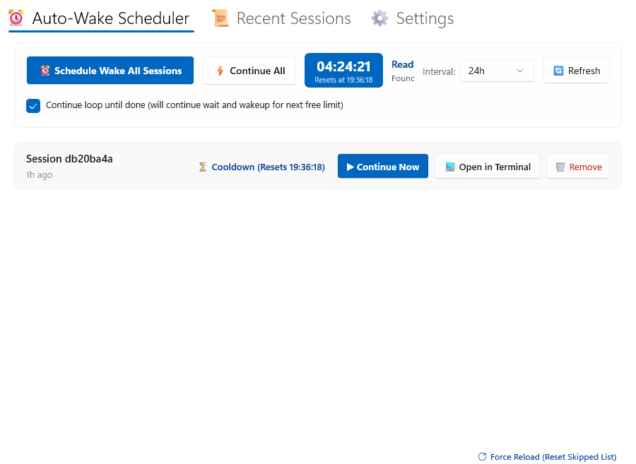

# ⚡ Quick Claude Wake

<p align="center">
  <strong>Hit the 5-hour Claude rate limit? Stop babysitting your terminal. Let Quick Claude Wake resume your tasks automatically the second your quota resets.</strong>
</p>

<p align="center">
  <a href="https://github.com/uponatime2019/QuickClaudeWake/releases/latest"></a>
  
  
  
  <a href="LICENSE"></a>
  
</p>

---

## 😫 The Problem: The 5-Hour Rate Limit Wall

You're deep in the zone with **Claude Code CLI** on a major refactor or building a complex feature overnight. Suddenly:

```text
You have reached your Claude Code usage limit. 
Your limit will reset in 4 hours 58 minutes (at 3:15 AM)...
```

- 😴 **Do you set an alarm for 3:15 AM?** No way.
- ⏳ **Do you wait until morning?** You lose 4–6 prime hours when Claude could have been writing code, running tests, and finishing your task.
- 🔄 **What if it hits another limit an hour later?** You start the waiting cycle all over again.

---

## 💡 The Solution: Quick Claude Wake

**Quick Claude Wake** is a lightweight, standalone Windows companion for Claude Code CLI. It monitors your local sessions, calculates the exact reset time down to the second, and automatically wakes Claude up with:

```powershell
claude --resume <session-id> --effort max --permission-mode auto -p "continue"
```

| Without Quick Claude Wake ❌ | With Quick Claude Wake ⚡ |
| :--- | :--- |
| Rate limited at 11:00 PM; session halts completely. | Rate limited at 11:00 PM; auto-wake arms instantly. |
| You sleep; 5 hours of quota go completely wasted. | At 4:00 AM, Claude wakes up automatically and keeps coding. |
| You wake up at 8:00 AM, manually restart, and wait *again*. | You wake up at 8:00 AM to a finished, tested project. |
| Endless manual terminal babysitting. | **Zero-touch continuous loop mode** until all tasks are done. |

---

## 📸 Screenshot



---

## ⚡ Try It Now / Download

Zero installation required. Single portable `.exe` that runs from any folder.

👉 **[Download Latest Release (QuickClaudeWake-win-x64.zip)](https://github.com/uponatime2019/QuickClaudeWake/releases/latest)**

1. **Download & extract** the `.zip` anywhere (e.g. `C:\Tools\QuickClaudeWake`).
2. **Launch** `QuickClaudeWake.exe`.
3. It immediately scans your local Claude Code sessions (`~/.claude/projects/`) and displays their countdown status!

---

## ✨ Key Features

- ⏰ **Smart Auto-Wake Scheduler**: Scans sessions stopped by rate limits and resumes them at the exact reset second without any manual input.
- 🔄 **Continuous Loop Mode**: Long jobs that hit multiple rate limits in a row? Quick Claude Wake stays vigilant, cycling through cooldowns and resumes until every task finishes.
- ⏱️ **Visual Global Cooldown Timer**: Top-level countdown header tracks your exact time remaining until quota renewal.
- 🚀 **1-Click Terminal Launch**: Need to step in? Open any session directly in **Windows Terminal (`wt.exe`)** or `cmd.exe` right inside its project working directory.
- 📜 **Session History & Prompt Previews**: Browse recent Claude Code conversations across all repositories with timestamps, message counts, and prompt snippets.
- 🔔 **Toast & Telegram Notifications**: Get native Windows notifications when a session wakes, plus optional Telegram bot alerts straight to your phone.
- 📊 **Optional Quota Tracker**: Optional live monitoring for custom token endpoints (e.g., GLM / Z.ai quota) configured cleanly in the UI.
- 🎨 **Modern Windows 11 UI**: Built with WinUI 3, native Mica material, responsive animations, and automatic Dark / Light mode switching.
- 🪶 **100% Portable**: Self-contained, unpackaged, zero registry clutter, and zero telemetry.

---

## 🔍 How It Works

Quick Claude Wake is non-invasive and requires no modifications to Claude Code CLI:

1. **Non-Invasive Session Discovery**: Reads the local session metadata that Claude Code natively writes to `~/.claude/projects/` (parsed safely with read-only file sharing).
2. **Rate Limit Detection**: Identifies whether the session ended due to rate limits or normal completion.
3. **Automated Resumption**: When the cooldown expires, it executes the official Claude Code CLI `resume` command with autonomous execution parameters.
4. **Clean Exit**: Once all sessions have finished their work, the app enters idle standby.

---

## 🏗️ Tech Stack

| Component | Technology | Description |
| :--- | :--- | :--- |
| **Runtime** | [.NET 8.0](https://dotnet.microsoft.com/download/dotnet/8.0) (`net8.0-windows10.0.19041.0`) | High-performance C# runtime with modern asynchronous architecture |
| **UI Framework** | [WinUI 3](https://microsoft.github.io/microsoft-ui-xaml/) (Windows App SDK 2.4) | Native Windows Fluent Design UI with Mica backdrop |
| **CLI Target** | Anthropic Claude Code CLI (`claude.exe`) | Seamless execution bridge for automatic resumption |
| **Settings** | `System.Text.Json` | Stored locally in `%LOCALAPPDATA%\QuickClaudeWake\settings.json` |
| **Distribution** | Standalone Unpackaged (`WindowsPackageType=None`) | No MSIX certificates, no Store dependencies, 100% portable |

---

## 🛠️ Building from Source

### Prerequisites
- **Windows 10 (1809+) or Windows 11**
- [.NET 8.0 SDK](https://dotnet.microsoft.com/download/dotnet/8.0)
- [Visual Studio 2022](https://visualstudio.microsoft.com/) with **.NET Desktop Development** workload

### Quick Build
```powershell
# Clone the repository
git clone https://github.com/uponatime2019/QuickClaudeWake.git
cd QuickClaudeWake

# Build the project
dotnet build "QuickClaudeWake.csproj" -p:Platform=x64

# Run locally
dotnet run --project "QuickClaudeWake.csproj"
```

### Self-Contained Publish
To compile a single portable folder ready for distribution:
```powershell
dotnet publish "QuickClaudeWake.csproj" -c Release -p:Platform=x64 -o "publish/QuickClaudeWake_Portable"
```

---

## 🗺️ Roadmap

- [x] Portable unpackaged execution with zero installer
- [x] Auto-detection for Claude Code 5-hour rate limits
- [x] Continuous loop scheduler for multi-rate-limit tasks
- [x] Native Windows toast notifications
- [x] Optional Telegram bot notifications
- [ ] Minimize to System Tray with background auto-wake
- [ ] Customizable sound alerts when sessions resume
- [ ] Multi-agent concurrent execution throttling

---

## 🤝 Contributing

Contributions, feedback, and pull requests are warmly welcomed!
- Found a bug or an unhandled session format? [Open an issue](https://github.com/uponatime2019/QuickClaudeWake/issues).
- Want to add a feature or improve the UI? Read our [CONTRIBUTING.md](CONTRIBUTING.md) and submit a PR!

If this tool saves you from waking up at 3 AM to resume Claude, give it a ⭐️ on GitHub!

---

## 📄 License

This project is licensed under the [MIT License](LICENSE).
